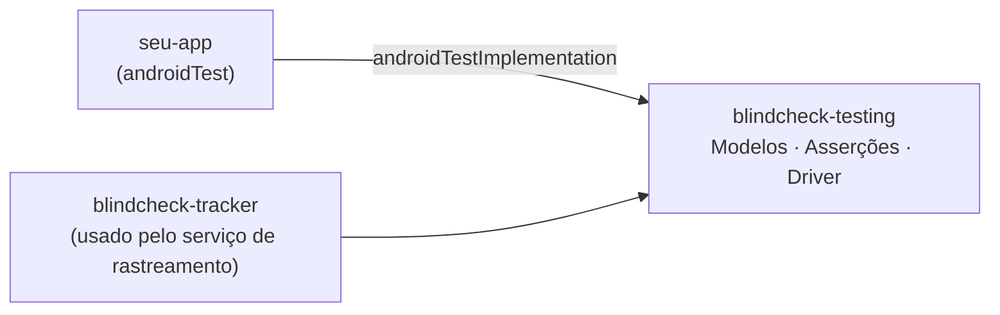

# BlindCheck — Guia de uso

BlindCheck responde a uma pergunta prática: **um usuário cego consegue entender, navegar e completar os fluxos do seu app?**

Para isso, a lib valida a camada de acessibilidade observável — eventos, foco, content descriptions, estados e ações — da forma exata que o TalkBack os interpreta. Não é um teste de UI visual: é um teste da experiência de quem usa o olhar dos dedos.

---

## Instalação

Adicione a dependência no módulo onde ficam seus testes instrumentados:

```kotlin
// app/build.gradle.kts
dependencies {
    androidTestImplementation(project(":blindcheck-testing"))
}
```

Se estiver consumindo como artefato publicado (ainda não disponível), o grupo será `com.theustech`.

---

## Conceito central

Toda interação parte de dois objetos criados no seu teste:

```kotlin
private val setup  = AndroidAccessibilitySetup.create()
private val driver = AndroidAccessibilityTestDriver.create()
```

| Objeto | Responsabilidade |
|---|---|
| `AndroidAccessibilitySetup` | Habilita acessibilidade no dispositivo antes do teste |
| `AndroidAccessibilityTestDriver` | Faz asserções sobre o que está acessível na janela atual |

---

## Setup mínimo

```kotlin
@get:Rule
val composeRule = createAndroidComposeRule<MainActivity>()

private val setup  = AndroidAccessibilitySetup.create()
private val driver = AndroidAccessibilityTestDriver.create()

@Before
fun enableAccessibility() {
    setup.ensureAccessibilityEnabled()
    composeRule.waitForIdle()
}
```

`ensureAccessibilityEnabled()` escreve nas configurações seguras do Android para que o sistema de acessibilidade processe os eventos — obrigatório mesmo sem o TalkBack ligado.

---

## Os dois estilos de teste

### Estilo 1 — Verificação estática (o que está acessível na tela)

Use quando quer garantir que um elemento **existe e é acessível**, independente de navegar até ele.

```kotlin
// Verifica que o campo existe na árvore de acessibilidade
driver.assertCurrentWindowContains(
    FocusExpectation(textContains = "E-mail", editable = true)
)

// Verifica que a mensagem de erro aparece após uma ação
driver.assertCurrentWindowContains(
    FocusExpectation(textContains = "Informe o e-mail")
)

// Verifica que uma imagem tem contentDescription
driver.assertCurrentWindowContains(
    FocusExpectation(contentDescriptionContains = "Imagem de Banana")
)
```

### Estilo 2 — Jornada (navegação como o TalkBack faria)

Use quando quer simular o fluxo real de um usuário cego: swipes para navegar, duplo-toque para ativar.

```kotlin
@Test
fun loginJourney_swipeNavigation_logsInSuccessfully() = runTest {
    val actions = driver.actions()

    actions.next()   // swipe direita → foco no heading
    driver.assertFocused(FocusExpectation(textContains = "Acessar conta"))

    actions.next()   // swipe direita → foco no campo e-mail
    driver.assertFocused(FocusExpectation(textContains = "E-mail", editable = true))
    actions.activate()                     // duplo-toque para ativar o campo
    actions.inputText("dev@example.com")

    actions.next()   // swipe direita → foco no campo senha
    actions.activate()
    actions.inputText("123456")

    actions.next()   // swipe direita → foco no botão
    driver.assertFocused(FocusExpectation(textContains = "Entrar", clickable = true))
    actions.activate()                     // duplo-toque para submeter

    composeRule.waitForIdle()
    driver.assertCurrentWindowContains(FocusExpectation(textContains = "Frutas"))
}
```

---

## API de ações (`UserAccessibilityActions`)

Obtido via `driver.actions()`. Todos os métodos são `suspend`.

| Método | Equivalente TalkBack | Comportamento físico |
|---|---|---|
| `next()` | Swipe para direita | Desloca o foco de acessibilidade para o próximo elemento |
| `previous()` | Swipe para esquerda | Desloca o foco para o elemento anterior |
| `activate()` | Duplo-toque | Ativa o elemento com foco atual |
| `scrollForward()` | Swipe para cima com dois dedos | Rola o conteúdo para frente |
| `scrollBackward()` | Swipe para baixo com dois dedos | Rola o conteúdo para trás |
| `inputText(value)` | Teclado | Define texto no campo editável com foco |
| `back()` | Botão Voltar | Navega para a tela anterior |

```kotlin
val actions = driver.actions()

actions.next()
actions.activate()
actions.inputText("texto")
actions.back()
```

---

## API de asserções (`AndroidAccessibilityTestDriver`)

### `assertCurrentWindowContains(expectation)`

Verifica que **algum nó** na janela ativa satisfaz a expectativa. Tem retry automático com timeout de 2s.

```kotlin
driver.assertCurrentWindowContains(FocusExpectation(textContains = "Frutas"))
```

### `assertFocused(expectation)`

Verifica que o nó **com foco de acessibilidade atual** satisfaz a expectativa.

```kotlin
driver.assertFocused(FocusExpectation(textContains = "Entrar", clickable = true))
```

### `assertCurrentWindowFeedback(expectation)`

Verifica que existe texto anunciável contendo a string. Útil para mensagens de erro e feedback de estado.

```kotlin
driver.assertCurrentWindowFeedback(FeedbackExpectation(contains = "Informe o e-mail"))
```

### `focusFirst(expectation): Boolean`

Move o foco de acessibilidade para o primeiro nó que satisfaz a expectativa. Retorna `true` se encontrou, `false` se não.

```kotlin
val reached = driver.focusFirst(FocusExpectation(textContains = "Banana"))
assertTrue("Item Banana deve ser alcançável via acessibilidade", reached)
```

### `currentWindowEvents()`

Retorna todos os nós da janela como uma lista de eventos sintéticos. Útil para `FocusSequenceExpectation`.

```kotlin
val events = driver.currentWindowEvents()
```

---

## `FocusExpectation` — referência completa

Matcher que descreve o que você espera de um nó de acessibilidade. Todos os parâmetros são opcionais e funcionam como filtros cumulativos (AND).

```kotlin
FocusExpectation(
    textEquals              = "Entrar",           // texto exato
    textContains            = "Entr",             // texto parcial
    contentDescriptionEquals    = "Botão entrar", // contentDescription exata
    contentDescriptionContains  = "Imagem de",    // contentDescription parcial
    clickable = true,   // elemento deve ser clicável
    editable  = true,   // elemento deve ser editável (campo de texto)
    enabled   = true,   // elemento deve estar habilitado
    selected  = false,  // estado de seleção esperado
    checked   = false,  // estado de marcação esperado (checkbox, switch)
)
```

**Exemplos práticos:**

```kotlin
// Campo de texto de e-mail
FocusExpectation(textContains = "E-mail", editable = true)

// Botão de submit
FocusExpectation(textContains = "Entrar", clickable = true)

// Imagem com descrição (sem texto visível)
FocusExpectation(contentDescriptionContains = "Imagem de Banana")

// Botão desabilitado
FocusExpectation(textContains = "Confirmar", clickable = true, enabled = false)
```

---

## `FocusSequenceExpectation` — ordem de leitura

Verifica se um conjunto de elementos aparece **na ordem correta** na árvore de acessibilidade. O TalkBack lê os elementos nessa ordem ao fazer swipes, então essa asserção valida o reading order do seu app.

```kotlin
FocusSequenceExpectation(
    items = listOf(
        FocusExpectation(textContains = "Acessar conta"),    // heading
        FocusExpectation(textContains = "E-mail", editable = true),
        FocusExpectation(textContains = "Senha",  editable = true),
        FocusExpectation(textContains = "Entrar", clickable = true),
    ),
).assertMatches(
    events = driver.currentWindowEvents(),
    targetPackage = "com.seu.app",
)
```

A verificação é **sub-sequência**: elementos intermediários entre os esperados não causam falha. A asserção garante a ordem relativa, não a ausência de outros elementos.

**Quando usar:** quando a ordem de leitura for um requisito de acessibilidade explícito (ex.: formulários, onboardings, listas de conteúdo editorial).

---

## Padrões recorrentes

### Testar que erros de validação são acessíveis

```kotlin
@Test
fun emptySubmit_errorsAreAnnouncedByScreenReader() = runTest {
    val actions = driver.actions()

    // Navega até o botão e submete sem preencher
    actions.next() // heading
    actions.next() // e-mail
    actions.next() // senha
    actions.next() // botão Entrar
    actions.activate()
    composeRule.waitForIdle()

    // Erros devem aparecer na árvore de acessibilidade
    driver.assertCurrentWindowContains(FocusExpectation(textContains = "Informe o e-mail"))
    driver.assertCurrentWindowContains(FocusExpectation(textContains = "Informe a senha"))
}
```

### Testar que imagens têm descrição

```kotlin
@Test
fun productImage_hasContentDescription() {
    // Navega até a tela de detalhe...

    driver.assertCurrentWindowContains(
        FocusExpectation(contentDescriptionContains = "Imagem de Banana")
    )
}
```

### Testar que um elemento é alcançável

```kotlin
@Test
fun backButton_isFocusableAndClickable() {
    val reached = driver.focusFirst(
        FocusExpectation(textContains = "Voltar", clickable = true)
    )
    assertTrue("Botão Voltar deve ser alcançável via acessibilidade", reached)
}
```

### Testar navegação entre telas

```kotlin
@Test
fun fruitItem_activating_opensFruitDetail() = runTest {
    val actions = driver.actions()
    loginViaSwipeNavigation()

    actions.next() // heading "Frutas"
    actions.next() // primeiro item
    driver.assertFocused(FocusExpectation(textContains = "Banana"))

    actions.activate()
    composeRule.waitForIdle()

    driver.assertCurrentWindowContains(
        FocusExpectation(contentDescriptionContains = "Imagem de Banana")
    )
}
```

---

## O que a lib NÃO substitui

| Aspecto | O que testar com |
|---|---|
| Layout visual, cores, contraste | Testes manuais ou ferramentas de lint |
| Renderização correta de componentes | Compose UI tests (`assertIsDisplayed`, etc.) |
| Lógica de negócio e estados | Unit tests |
| Acessibilidade real com TalkBack | Teste manual no dispositivo |

BlindCheck valida a **camada de acessibilidade do Android** — o que o sistema expõe para leitores de tela. É complementar, não substituto, dos outros tipos de teste.

---

## Estrutura de módulos



O único módulo que você precisa como dependência de teste é `:blindcheck-testing`. Os demais (`:blindcheck-tracker`, `:blindcheck-interactor`, `:blindcheck-tracking-app`) são infraestrutura interna do sistema de rastreamento de eventos.
