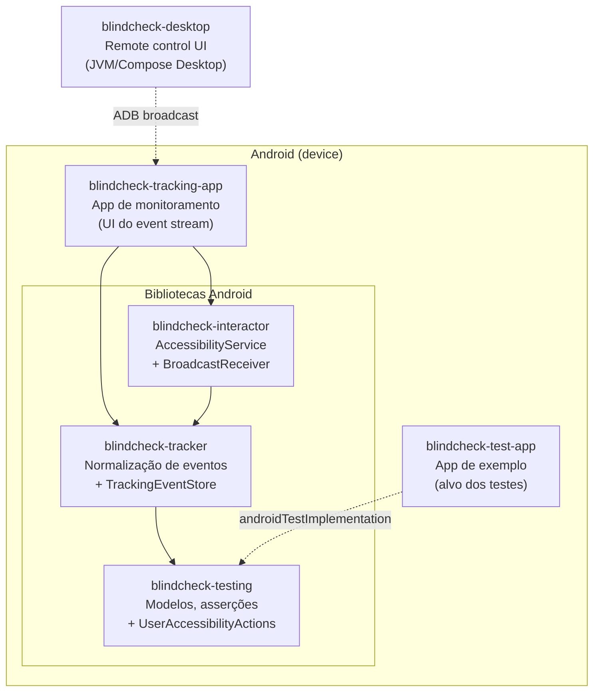
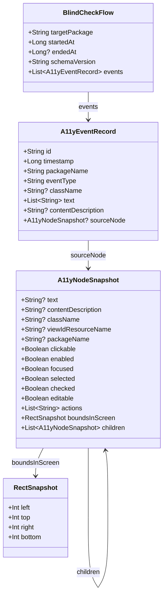
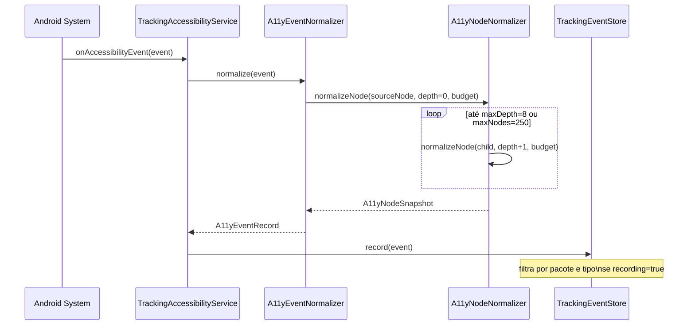
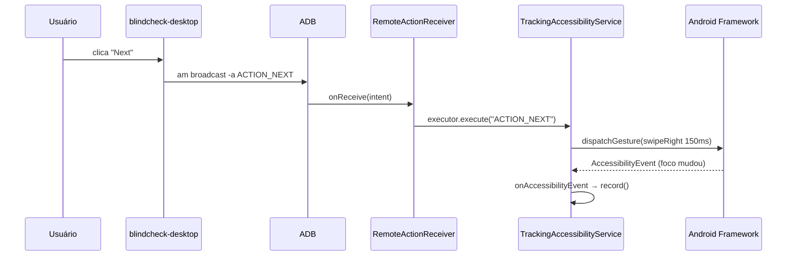
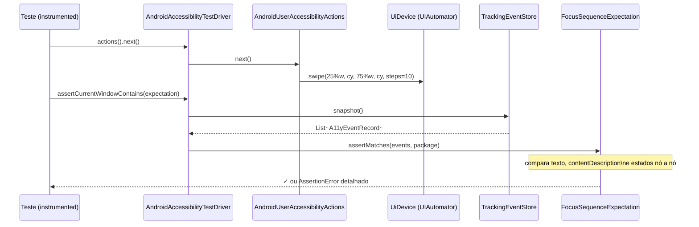
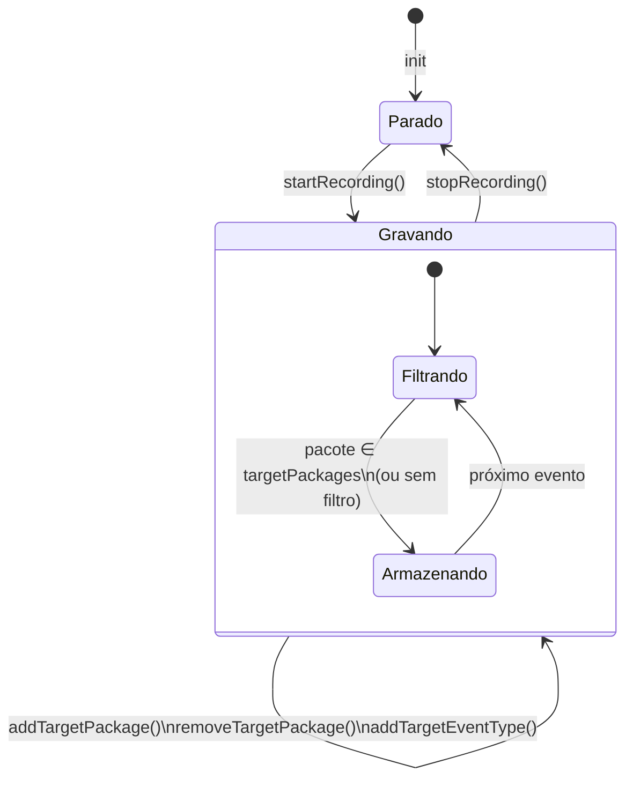
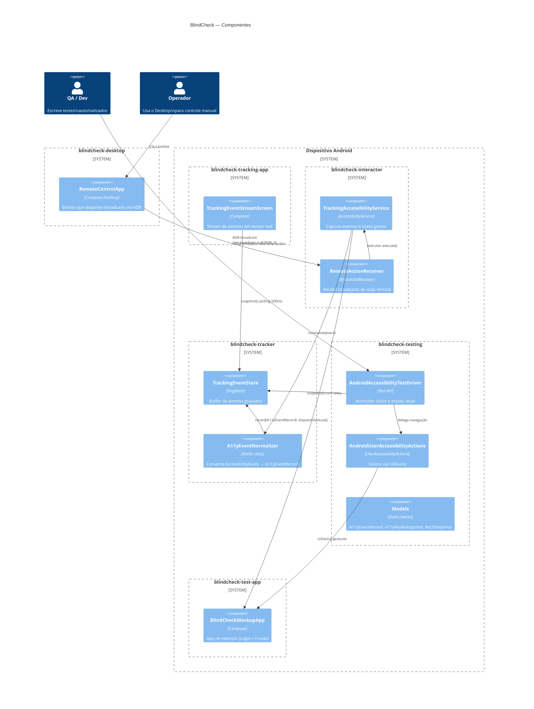

# BlindCheck — Arquitetura do Sistema

BlindCheck é uma plataforma de testes de acessibilidade para Android voltada a usuários cegos. Ela valida a camada de acessibilidade observável: eventos, foco, content descriptions, estados e ações — da forma como um usuário de TalkBack os experimenta.

---

## Módulos

> Linhas sólidas = dependência de compilação. Linha tracejada do Desktop = chamada de processo (ADB).

---

## Responsabilidade de cada módulo

| Módulo | Tipo | Responsabilidade |
|---|---|---|
| `blindcheck-testing` | Android lib | Modelos de dados imutáveis, interface `UserAccessibilityActions`, asserções de foco, driver de teste |
| `blindcheck-tracker` | Android lib | Normalização de `AccessibilityEvent`/`NodeInfo`, `TrackingEventStore`, constantes de ação remota |
| `blindcheck-interactor` | Android lib | `TrackingAccessibilityService`, `RemoteActionReceiver`, injeção de gestos |
| `blindcheck-tracking-app` | Aplicativo | UI Compose para stream de eventos em tempo real, filtros, exportação |
| `blindcheck-test-app` | Aplicativo | App de exemplo determinístico (Login → Lista de Frutas → Detalhe) |
| `blindcheck-desktop` | JVM Desktop | Remote control com botões que disparam broadcasts via ADB |

---

## Modelos de dados centrais

Todos os modelos são data classes Kotlin imutáveis e sem dependência do Android framework — serializáveis para JSON.

---

## Pipeline de captura de eventos

---

## Fluxo de controle remoto (Desktop → Gesto)

O `RemoteActionReceiver` valida se a ação está no conjunto `SUPPORTED_ACTIONS` antes de delegar. O `executor` é a própria instância do service — `TrackingAccessibilityService` implementa `ActionExecutor`.

---

## Gestos implementados

```mermaid
flowchart LR
    subgraph Ações["execute(action)"]
        NEXT["ACTION_NEXT\n→ swipe direita 25%→75% w\n150ms"]
        PREV["ACTION_PREVIOUS\n→ swipe esquerda 75%→25% w\n150ms"]
        ACT["ACTION_ACTIVATE\n→ dois toques no centro\n0ms + 100ms offset"]
        BACK["ACTION_BACK\n→ GLOBAL_ACTION_BACK"]
        SF["ACTION_SCROLL_FORWARD\n→ 2 dedos p/ cima 70%→30% h\n400ms"]
        SB["ACTION_SCROLL_BACKWARD\n→ 2 dedos p/ baixo 30%→70% h\n400ms"]
        HOME["ACTION_HOME\n→ GLOBAL_ACTION_HOME"]
        REC["ACTION_RECENTS\n→ GLOBAL_ACTION_RECENTS"]
        SU["ACTION_SWIPE_UP\n→ 1 dedo p/ cima 80%→20% h\n600ms"]
        SD["ACTION_SWIPE_DOWN\n→ 1 dedo p/ baixo 20%→80% h\n600ms"]
    end
```

Os gestos de navegação (next/previous) reproduzem exatamente o comportamento do TalkBack. O double-tap do `activate` usa dois `StrokeDescription` de 1ms com 100ms de intervalo, que o TalkBack interpreta como ativação do elemento focado.

---

## Fluxo de teste instrumentado

O driver usa polling com retry (timeout 2s, intervalo 50ms) para aguardar o evento aparecer no store antes de falhar.

---

## TrackingEventStore — máquina de estado

O store é um singleton (`TrackingEventStore.shared`). A lista interna é um `mutableListOf` protegido por `@Volatile` no flag `isRecording`. Os filtros de pacote e tipo são `LinkedHashSet` para preservar ordem de inserção.

---

## Diagrama de componentes (C4 nível 2)

---

## Makefile — comandos de operação

| Target | Descrição |
|---|---|
| `make enable-tracking` | Ativa o serviço de acessibilidade BlindCheck no dispositivo |
| `make enable-talkback` | Ativa o TalkBack junto ao BlindCheck |
| `make disable-talkback` | Desativa o TalkBack mantendo o BlindCheck |
| `make next` | Envia `ACTION_NEXT` via ADB |
| `make previous` | Envia `ACTION_PREVIOUS` via ADB |
| `make activate` | Envia `ACTION_ACTIVATE` via ADB |
| `make back` | Envia `ACTION_BACK` via ADB |
| `make scroll-forward` / `make scroll-backward` | Scroll com dois dedos |
| `make home` / `make recents` | Ações globais do sistema |
| `make swipe-up` / `make swipe-down` | Gestos verticais de dedo único |
| `make logcat` | Filtra logs das tags BlindCheck |

---

## Decisões de design relevantes

### 1. Gestos reais em vez de ações virtuais
`AccessibilityNodeInfo.performAction(ACTION_CLICK)` não funciona para UI do sistema (app drawer, launcher). Todos os comandos de navegação usam `AccessibilityService.dispatchGesture()` com `GestureDescription`, reproduzindo o comportamento físico que o TalkBack intercepta.

### 2. Separação de camadas
- **Modelos** não dependem do Android framework — são data classes puras, serializáveis.
- **blindcheck-testing** exporta a API pública de asserções sem expor `AccessibilityNodeInfo` ou `AccessibilityEvent`.
- **blindcheck-tracker** expõe `blindcheck-testing` via `api()`, tornando os modelos transitivos para os consumidores.

### 3. Manifesto por merge
O `blindcheck-interactor` declara o `<service>` e o `<receiver>` no próprio `AndroidManifest.xml`. Ao ser incluído como dependência, o Android Gradle Plugin faz o merge automático no manifesto do app — o `blindcheck-tracking-app` não precisa repetir as declarações.

### 4. `internal` como barreira de módulo
`TrackingAccessibilityService.executor` é `internal`, acessível apenas dentro de `blindcheck-interactor`. O `setExecutorForTest()` é `public` para permitir injeção em testes instrumentados de outros módulos, sem expor o campo diretamente.
